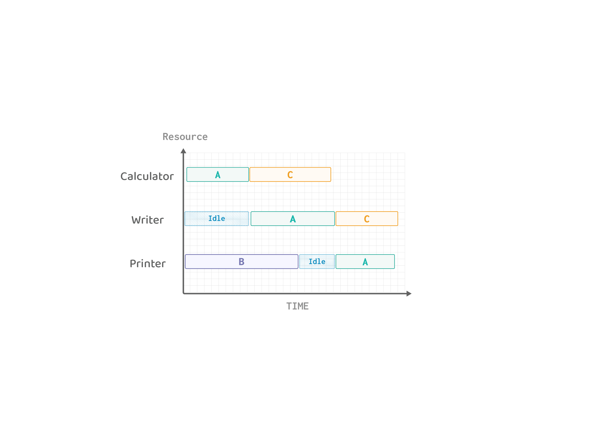
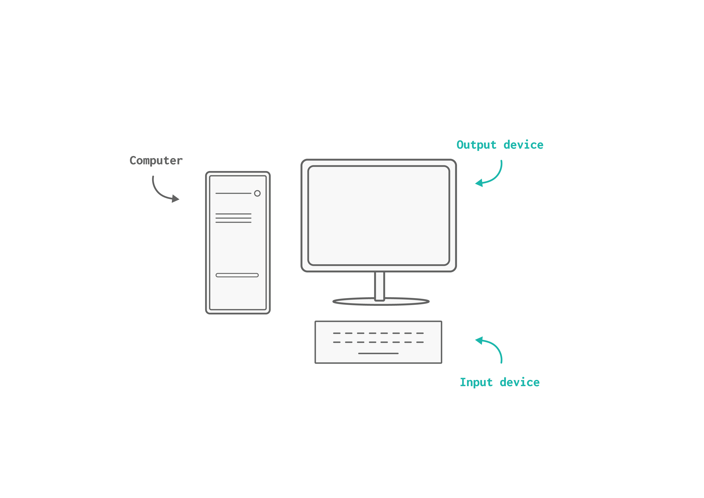
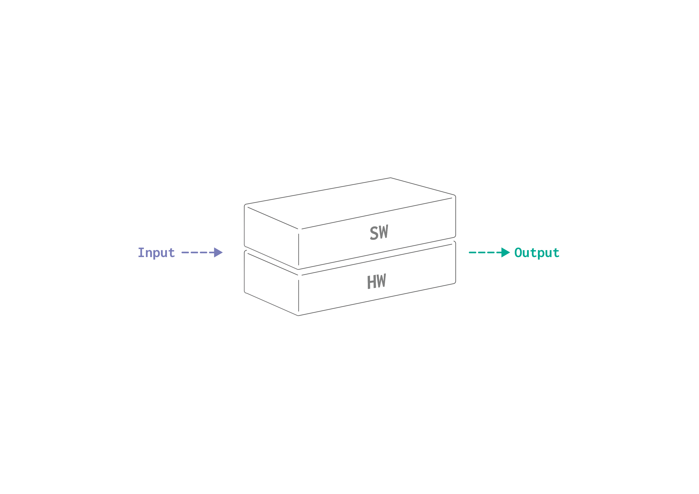
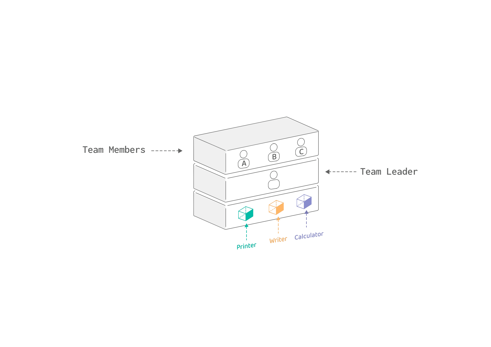
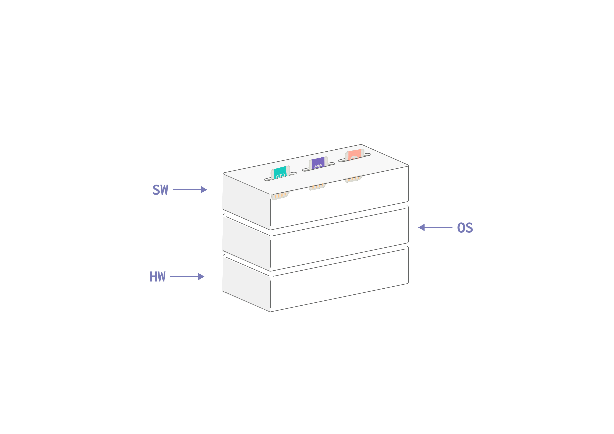
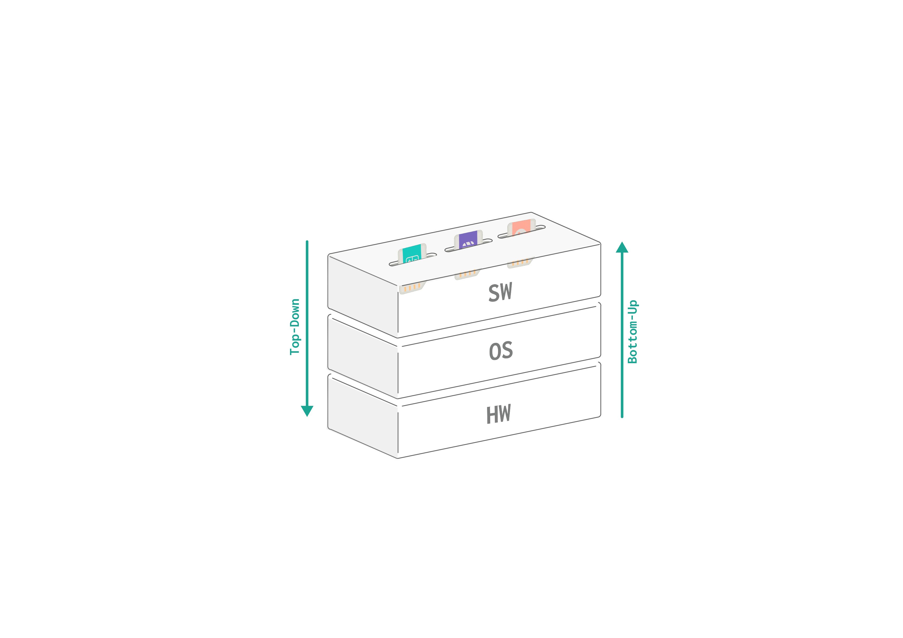
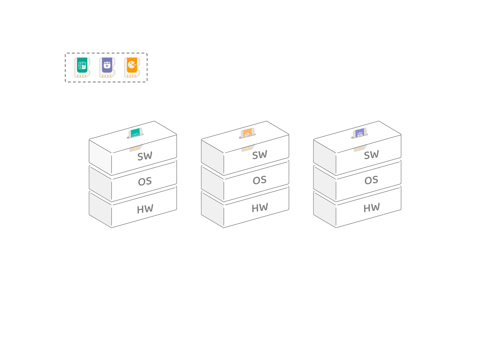
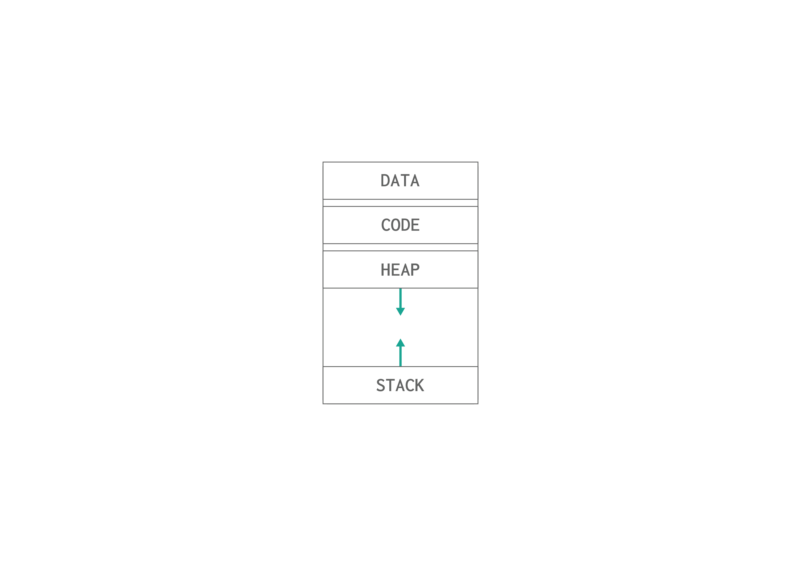

# Introduction
Before explaining the operating systems concept, lets take an example.

In a company, there is an employee called **A** who would like to use the company's resources to complete his task. He needs a calculator, a document writer, and a printer. 
- **Calculator**: Calculate a mathematical operation.
- **Writer**: Write the result in a document.
- **Printer**: Print a document.

All these resources are available in the **office room** and he can have full control of it at any time since there is no one else needs it. 

However, the demand for the company's services increased and more team members have joined. After C and B had joined there was a conflict in using these resources.
A, B, and C, each have their own tasks to complete, but to do so they need the resources in the office room. 

A, have a problem to solve, write the solution, and then print it.
> **A** needs: calculator -> writer -> printer.

B, have a ready-made document that needs to be printed.
> **B** needs: printer.

C, have a problem to solve and to write it as a document.
> **C** needs: calculator -> writer .

What do you think will happen in this case? The team had a conflict about who can use the resource first. Each member takes his own task as a priority and want to complete it.

**What do you think should happen?** 
In this case, the team leader/office manager should manage the use of resources by assigning each member to a resource. 

- Calculator: A then C
- Writer: None
- Printer: B

1. A can use the calculator first and C should wait until it becomes available.
2. Once A has finished from the calculator he can directly use the writer since it is available.
3. C can use the calculator since A has finished. 
4. B can directly use the printer since no one needs it.
5. A must wait for B to finish from the printer and use it to complete his job.

The team leader can decide if C or A should use the calculator based on the strategy he follows. If based on priority, C might use the calculator first if he has a higher priority task. If based on who came first, A should use the calculator first.

In the end, the company's services are provided. But how it was managed internally depends on its structure & organization.

The company takes an input which is the request, handles it, and then produces an output. Same as the computer. 

The computer internally is composed of two parts, the software and the hardware. 

<!-- not found -->

In early computers, there was only one software running on the hardware. The software had full control over the hardware, same as the first case with A being the only employee who needed the resources.
But with the evolve of computer systems, computer manufacturers wanted to make use and utilize the hardware more efficiently by running several programs at the same time. To do so, a specialized software was developed which is the **operating system**.

The operating system acts as a mediator just like the team leader from the example between software programs and hardware resources to manage its usage. 

By being a mediator, the operating system provides the programs with a list of services it can perform for them and manage the usage of the hardware resources.

**Operating System Purpose**
The purpose of operating systems can be viewed from two directions:
-  Top-Down: Provide simple APIs for software programs to use.
-  Bottom-up: Manages resources and schedules their usage.

## Termonologies

### Software
Software (aka. program) is a set of instructions that drives the hardware to perform. Sometimes software programs are categorized into *System software* and *Application software*. Both are fundamentally the same, but they are used for different purposes. 

**Application Software**
It is a common type of software program. Application software is written for normal users to perform their tasks. For example, games and text editors.

**System Software**
System software is written for the system to enable it to perform its job and help application software to do its intended tasks. For example, compilers and operating systems.

### Hardware 
Hardware refers to the physical resources in a computer. It contains the resources needed by the computer to perform. The essential hardware resources are the following,
- **CPU**: aka. processor is responsible for executing instructions.
- **Main Memory**: used for storing data temporarily. 
<!-- - **Disk**: used for storing data permanently.  -->
- **I/O devices**: used to get input and produce output.

### Operating System
Now we know the key concepts of computer systems, we can dive deep into the operating system and its purpose. 

`Operating System` is widely known as a system software that manages both hardware and software resources of a computer. 

<!-- Once again, `Operating system` is a system software since it is written to manage the operating of a computer system. By managing the hardware resources allocations to programs and providing software programs with simple APIs or services to access hardware resources.  -->

### Operating System Perspective 
Operating systems as described earlier, act as a mediator between hardware resources and software programs for two reasons. First, to provide programs with an interface of services they can request. Second, to manage hardware resources for better utilization.

Since early computers couldn't run two programs at the same time because programs needed to dominate the hardware resources to execute, Operating systems managed to run several programs at the same time by misleading the programs into believing that each of them had the computer resources for itself. But the truth is that OS manages programs by suspending some and executing others so quickly that they seems to run at the same time. However, that is just an illusion given by the OS.

>The image above represents the illusion given by operating systems, each program thinks the computer is for itself.

OS wouldn't manage programs and evolve as we see them today without the concept of `process`.

### Process 
What is a process? **`Process` is a program in execution**. When you run a program by clicking the program icon, operating systems map that program into a process like filling a form of data. Answering how much storage it needs? Assign it an id and status etc... By doing this, the operating system is able to manage the program execution and assign it the resources it needs. 

**What happens in the background when you run a program?**
At first, programs are just an execution **file** sitting on the disk storage. When you click the program icon, the operating system loads the program into main memory as a **process**, and then the CPU starts reading the program instructions and executing them.

The process has a uniform structure that it applies to when loaded to the main memory as shown in the image below.

Operating systems handle programs as processes to unify how they execute and manage programs. If each program has its own structure, the operating system won’t be able to handle all programs and will only support a range of them. This conflicts with the purpose of the operating systems.

You can think about it like in restaurants, when you give the waiter your order, you need to use a language that he understands so he can serve you. After taking your order, he will pass it to the kitchen and let them perform the order, and deliver it when finished. We conclude that in order to perform your request, there are set of rules you need to follow. The same goes with the operating system which acts as the waiter. Programs should talk in a language the operating system understands to perform their requests, which is the *language of processes*.

