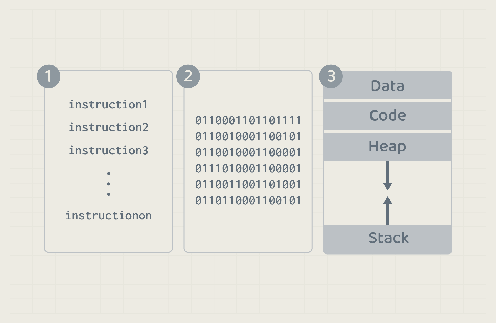

# Interacting with Operating Systems 
As normal users, we can interact with the OS by user interfaces such as a Graphical User Interface **GUI** when clicking programs and closing them or using the Command Line Interface **CLI**. However, software programs communicate with the OS using System Calls aka **syscalls**. The operating system provides software programs with a list of services they can request to access a resource or do an action which is syscalls. 

Syscalls are used to manage processes, memory, files, and much more. As programmers, we develop software programs. Therefore, we need to understand how to interact with the operating system through the use of syscalls in the development phase of a program. 

In the next topics, we will focus on syscalls that are related to memory management, process management, and I/O syscalls. But first, we will walk through the big picture of how operating systems handle processes. 

> Note: syscalls allow the software programs to access and utilize hardware resources without needing to know the underlying details.

## Program Life-Cycle
We are aiming to understand operating systems from the programmer's perspective. Hence, we are required to understand the phases our programs go through and how operating systems interact and manages them.

The program in its lifetime, is going to walk through several phases. 
1. Source Code
2. Executable File
3. Running Program (Process)

<!-- not found -->



At the start of creating a program, it will be just a **source code** which is a set of instructions written in a specific programming language. When the program is compiled, the **executable file** will be generated. The executable file is stored in the **disk** permanently until the user clicks on it to run. When a program is clicked, it will be mapped into **main memory** and will start running, at this moment, we call it a **Process**.


> The **process** is a program in execution.

## Example 

Hello World program in C. 

```c
#include <stdio.h>

int main(){
    puts("Hello World");
    return 0;
}
```
The program at first is a set of instructions to tell the computer to print `Hello World` when it runs. However, the computer can not understand high-level programming languages directly, we need to compile the program file to get an executable file and run it for execution. 

compile C program 
```
gcc hello.c -o out
```
once we run the command above, the compiled file will appear `out`

run the executable file
```
./out
```

Running the executable file will produce the following output.
```
Hello World
```

